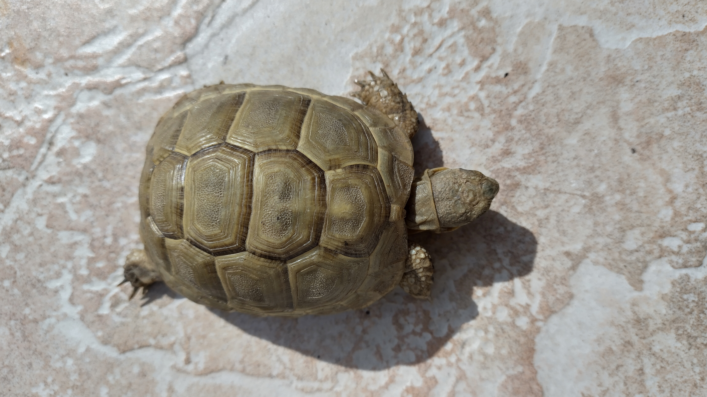

## My first markdown file
This is markdown file

I like Github and you can find at this webpage: [Github](http://github.com)

I like turtles Testudo graeca. Have a look at mine !

What I plan to do in the next three years:
1. breed turtles
1. start a rock band
1. make my own beer

    - not only with Saccharomyces spp.
    - but also with lactic acid bacteria

## Let's have some mathematical formula

A well-known one: $E=mc^2$

python
# This is a Python example:
def greet (name):
    print(f"Hello, {name}!)

greet ("world")

Let's make some changes in the first version.
